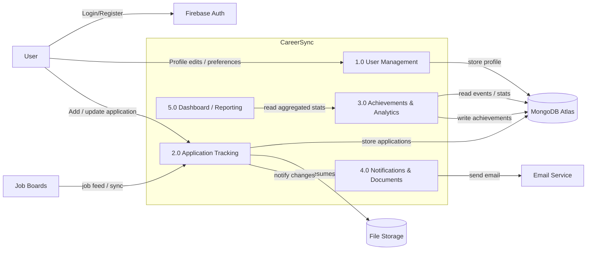

DFD Level 1 — CareerSync (Top-level Processes)

This diagram decomposes the system into its main processes and shows the major data flows and stores.



Process descriptions:
- 1.0 User Management: handles authentication (via Firebase) and profile CRUD operations stored in MongoDB.
- 2.0 Application Tracking: create/update/delete job applications, attach documents, and synchronize job metadata from external job boards.
- 3.0 Achievements & Analytics: aggregates user activity and calculates achievements and streaks; writes achievement records to the user document.
- 4.0 Notifications & Documents: queues and sends email notifications and stores uploaded documents (resumes, cover letters) in file storage.
- 5.0 Dashboard / Reporting: reads analytics and achievements to present the user's dashboard and charts.

Data stores:
- `MongoDB Atlas`: user profiles, applications, achievements, stats.
- `File Storage`: user-uploaded documents.

Open `docs/DFD_Level_2.md` for a Level 2 drill-down (job application process example).
```