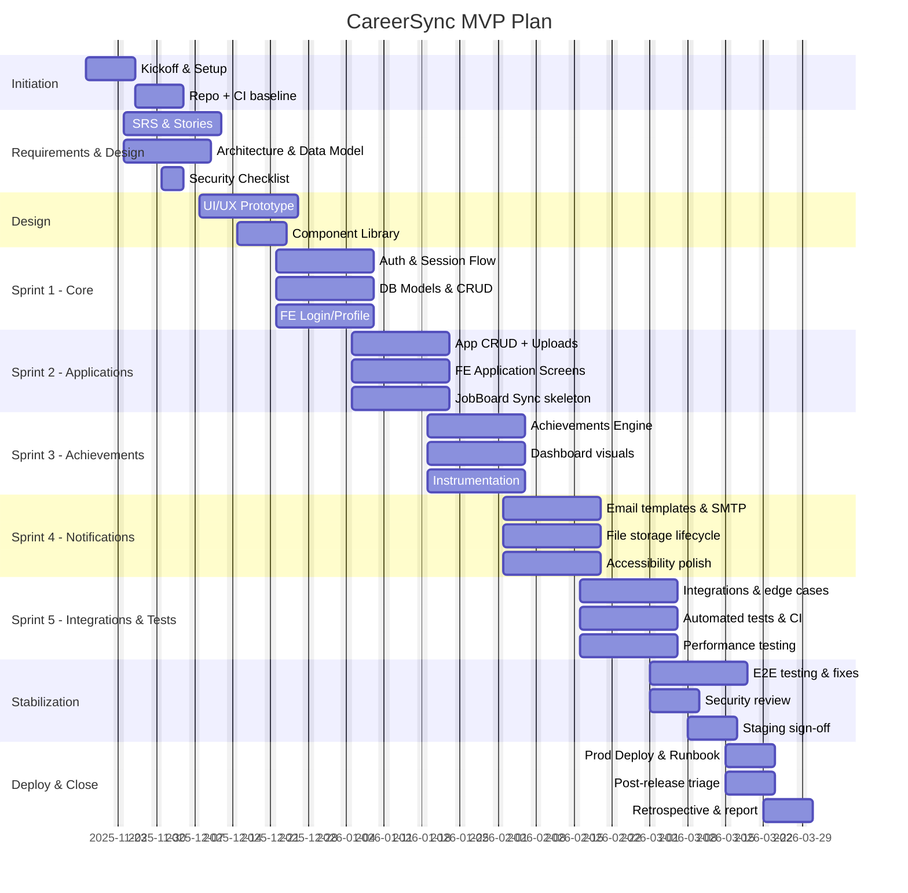

Gantt Chart — CareerSync

Planned start date: 2025-11-17 (Monday)
Total plan duration: 18 weeks (includes buffer)

Summary
- Objective: deliver CareerSync MVP (profile management, application tracking, achievements, notifications, dashboards) with CI/CD and basic monitoring.
- Team: 5 people (rotate leads as planned). Use owners as roles: PM, TechLead, FE, BE, QA, DevOps.
- Format: task list with durations, dependencies, estimated effort (person-hours), milestone dates, plus Mermaid Gantt for quick rendering.

Milestones
- M1 — Project Kickoff: 2025-11-17
- M2 — Requirements & Design Complete: 2025-12-05 (end of Week 3)
- M3 — MVP Feature Complete (Dev done): 2026-01-30 (end of Week 11)
- M4 — QA Sign-off/Staging Green: 2026-02-20 (end of Week 14)
- M5 — Production Release (MVP): 2026-03-07 (end of Week 16)
- M6 — Project Retrospective & Report: 2026-03-14 (end of Week 17)

High-level phases (tasks shown with durations and dependencies)

1) Initiation (Week 1)
- Task: Project kickoff & orientation
  - Duration: 1 week (2025-11-17 — 2025-11-23)
  - Owner: PM
  - Effort: 25 hours
  - Dependencies: none
- Task: Set up repo, CI basic, issue tracker, branch policy
  - Duration: 1 week (parallel)
  - Owner: DevOps / TechLead
  - Effort: 20 hours

2) Requirements & Architecture (Weeks 1–3)
- Task: Finalize SRS, user stories, acceptance criteria
  - Duration: 2 weeks (2025-11-24 — 2025-12-07)
  - Owner: PO / PM / TechLead
  - Effort: 80 hours
  - Dependencies: Kickoff
- Task: High-level architecture & data model (ER diagrams, API spec)
  - Duration: 1.5 weeks (2025-11-24 — 2025-12-05)
  - Owner: TechLead / BE
  - Effort: 60 hours
  - Dependencies: SRS draft
- Task: Security & compliance checklist, environment plan
  - Duration: 0.5 week (2025-12-01 — 2025-12-05)
  - Owner: TechLead / PM
  - Effort: 16 hours

3) Design & Prototyping (Weeks 3–5)
- Task: UI/UX wireframes and prototype (key screens: profile, application flow, dashboard)
  - Duration: 2 weeks (2025-12-08 — 2025-12-21)
  - Owner: FE / PO
  - Effort: 80 hours
  - Dependencies: Architecture & SRS
- Task: Component library + design tokens (Tailwind config, theme)
  - Duration: 1 week (2025-12-15 — 2025-12-21)
  - Owner: FE
  - Effort: 40 hours

4) Implementation — Iterative Sprints (Weeks 5–14)
Note: Sprints are 2 weeks each. We'll run ~5 sprints during this phase.

Sprint 1 (Weeks 5–6): Core backend and auth
- Task: Firebase auth integration + session flow
  - Duration: 1 sprint (2025-12-22 — 2026-01-04)
  - Owner: BE / FE
  - Effort: 60 hours
  - Dependencies: Env plan
- Task: DB models (User, Profile, Application) + basic CRUD API
  - Duration: 1 sprint
  - Owner: BE
  - Effort: 80 hours
- Task: FE login & profile pages (basic)
  - Duration: 1 sprint
  - Owner: FE
  - Effort: 60 hours

Sprint 2 (Weeks 7–8): Application tracking
- Task: Application create/update/list endpoints + file uploads
  - Duration: 1 sprint (2026-01-05 — 2026-01-18)
  - Owner: BE
  - Effort: 100 hours
- Task: FE application screens and doc upload UX
  - Duration: 1 sprint
  - Owner: FE
  - Effort: 80 hours
- Task: Background worker / sync with job boards (skeleton)
  - Duration: 1 sprint
  - Owner: BE
  - Effort: 40 hours

Sprint 3 (Weeks 9–10): Achievements & analytics
- Task: Achievements engine (rules, streaks) + schema changes
  - Duration: 1 sprint (2026-01-19 — 2026-02-01)
  - Owner: BE
  - Effort: 80 hours
- Task: FE dashboard visuals (charts) and achievement notifications
  - Duration: 1 sprint
  - Owner: FE
  - Effort: 80 hours
- Task: Instrumentation for metrics (event logging)
  - Duration: 1 sprint
  - Owner: BE / DevOps
  - Effort: 30 hours

Sprint 4 (Weeks 11–12): Notifications, email flows, polish
- Task: Email notifications & templates (SMTP integration)
  - Duration: 1 sprint (2026-02-02 — 2026-02-15)
  - Owner: BE / FE
  - Effort: 40 hours
- Task: File storage lifecycle and downloads (signed URLs)
  - Duration: 1 sprint
  - Owner: BE
  - Effort: 30 hours
- Task: Accessibility and responsive polish
  - Duration: 1 sprint
  - Owner: FE
  - Effort: 40 hours

Sprint 5 (Weeks 13–14): Integrations, test automation, performance tune
- Task: Final integration work (job boards enrich, edge cases)
  - Duration: 1 sprint (2026-02-16 — 2026-02-29)
  - Owner: BE
  - Effort: 40 hours
- Task: Add automated tests (unit + integration), CI coverage gates
  - Duration: 1 sprint
  - Owner: QA / FE / BE
  - Effort: 100 hours total across team
- Task: Performance testing & fix hotspots
  - Duration: 1 sprint
  - Owner: BE / DevOps
  - Effort: 30 hours

5) Stabilization & QA (Weeks 15–16)
- Task: End-to-end testing and defect fixes
  - Duration: 2 weeks (2026-03-01 — 2026-03-14)
  - Owner: QA / Devs
  - Effort: 120 hours
- Task: Security review and remediation
  - Duration: 1 week overlapping (2026-03-01 — 2026-03-07)
  - Owner: TechLead / BE
  - Effort: 40 hours
- Task: Staging smoke tests and sign-off
  - Duration: 1 week (2026-03-08 — 2026-03-14)
  - Owner: QA / PM
  - Effort: 32 hours

6) Deployment & Handover (Week 17)
- Task: Production deployment, monitoring setup, runbook
  - Duration: 1 week (2026-03-15 — 2026-03-21)
  - Owner: DevOps / TechLead
  - Effort: 40 hours
- Task: Post-release checklist, bug triage, immediate fixes
  - Duration: 1 week
  - Owner: Dev team
  - Effort: 40 hours

7) Project Closure (Week 18)
- Task: Retrospective, final report, benefit realization plan
  - Duration: 1 week (2026-03-22 — 2026-03-28)
  - Owner: PM / PO
  - Effort: 24 hours
- Task: Knowledge transfer & documentation freeze
  - Duration: 1 week
  - Owner: All
  - Effort: 40 hours

Risks & schedule buffer
- 2-week buffer included in the 18-week plan for unforeseen issues and dependency delays.
- If deadlines are fixed and shorter, we will prioritize features and de-scope lower-value items.

Mermaid Gantt chart (copy into a Mermaid-enabled preview or Markdown renderer). Dates use the plan start above; adjust `dateFormat` if needed.

How to use / next steps
- If you want calendar dates adjusted, tell me the actual start date and team availability and I'll re-generate the chart.
- I can commit this file and add the Mermaid-rendered SVGs into `docs/` if you want static images.
- I can export a CSV or a simple MS Project-friendly CSV for import.

Would you like me to commit this file to Git and mark the todo done? I can also update `docs/SPMP_CareerSync.md` to reference this Gantt file.